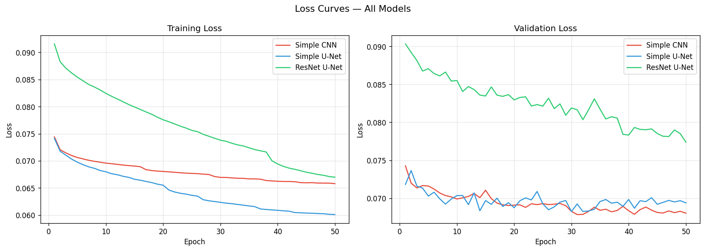
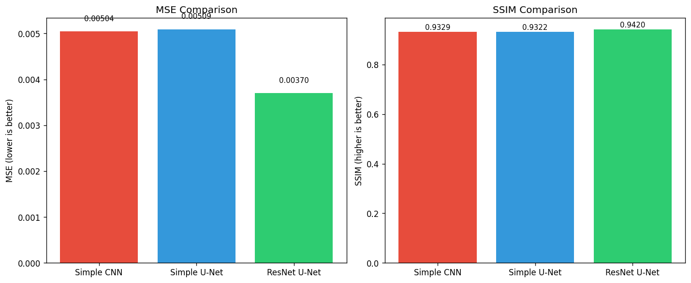
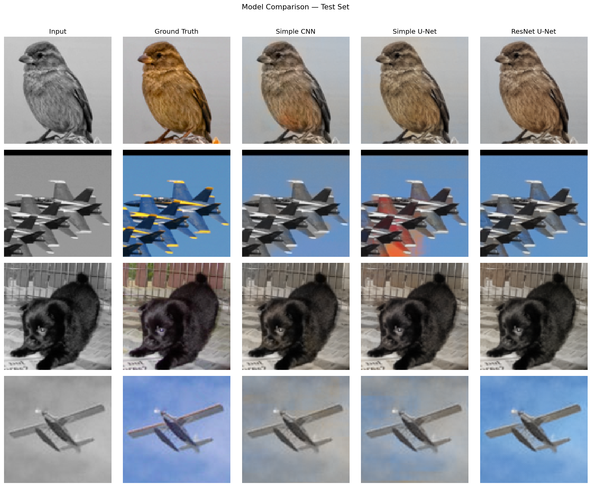
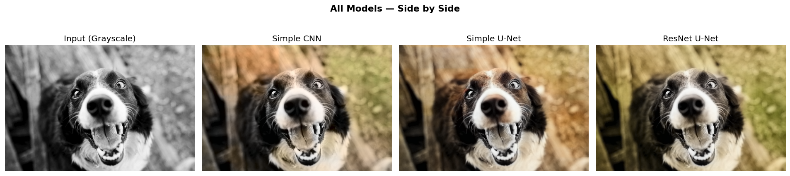
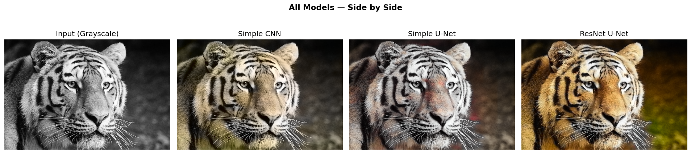
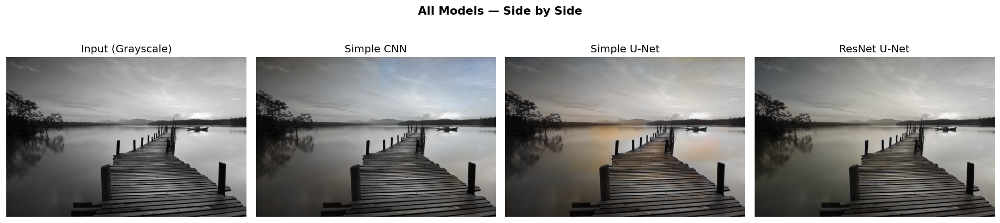
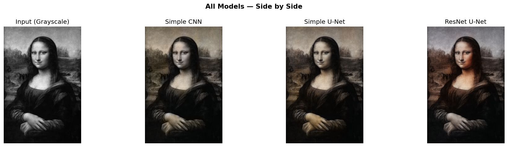

# Deep Learning-Based Image Colorization Using CNNs
**CS 615 – Deep Learning | Drexel University | March 2026**  
**Student: Mokshad Sankhe | Instructor: Prof. Matthew Burlick**

---

## Problem Statement

Many images exist only in grayscale, especially historical photographs and archived media. This project develops a deep learning system that automatically converts grayscale images into realistic color images by training convolutional neural networks on the STL-10 dataset.

---

## Dataset — STL-10

- 5,000 labeled training images + 100,000 unlabeled images + 8,000 test images
- 10 categories: airplane, bird, car, cat, deer, dog, horse, monkey, ship, truck
- Image size: 96×96 pixels
- Color space used: **LAB** (L = grayscale input, AB = color output)

Download STL-10 from https://www.kaggle.com/datasets/jessicali9530/stl10/ and organize as:
```
archive/
    train_images/
    test_images/
    unlabeled_images/
```

---

## Project Structure

```
├── simple_cnn.py              # Train Simple CNN
├── simple_unet.py             # Train Simple U-Net
├── train_resnetunet.py        # Train ResNet18 U-Net
├── compare_all.py             # Compare all models + single image colorization
├── requirements.txt
├── README.md
├── checkpoints/
│   ├── checkpoints_simplecnn/
│   ├── checkpoints_simpleunet/
│   └── checkpoints_resnet_unet/
└── results/
    ├── results_simplecnn/
    ├── results_simpleunet/
    ├── results_resnet_unet/
    └── results_comparison/
```
- Download Checkpoints and results from: https://drive.google.com/drive/folders/1AOhEBGklxPFg_h27hg0Spd9MaDuOEjE6?usp=sharing
---

## Installation

```bash
pip install -r requirements.txt
```

Requires Python 3.11+ and a CUDA-capable GPU (recommended).

---

## How to Run

### Step 1 — Train all 3 models

```bash
python simple_cnn.py
python simple_unet.py
python resnet_unet.py
```

Each script saves checkpoints to its own folder and logs training to a CSV file.  
To resume training from a checkpoint:

```bash
python simple_cnn.py --resume
python simple_unet.py --resume
python resnet_unet.py --resume
```

### Step 2 — Compare all models on the test set

```bash
python compare_all.py
```

Generates in `results/results_comparison/`:
- `visual_comparison.png` — side by side colorization on test images
- `metrics_comparison.png` — MSE and SSIM bar charts
- `loss_comparison.png` — training and validation loss curves

### Step 3 — Colorize a single image with all models

```bash
python compare_all.py --image your_image.jpg
python compare_all.py --image your_image.jpg --saturation 1.6
```

---

## Models

### Model 1 — Simple CNN
Plain encoder-decoder with no skip connections, trained from scratch.

```
Input (1ch) → Conv→ReLU×2 → MaxPool ×3 → Conv→ReLU×2 (bottleneck)
            → ConvTranspose ×3 → Conv(2ch) → Tanh → Output (2ch AB)
```

- Loss: L1Loss
- Optimizer: Adam (lr=1e-3)
- Scheduler: ReduceLROnPlateau
- Parameters: ~6.1M

---

### Model 2 — Simple U-Net
Adds skip connections between encoder and decoder, trained from scratch.

```
Encoder: enc1 → enc2 → enc3 → bottleneck
Decoder: up3 + skip(enc3) → up2 + skip(enc2) → up1 + skip(enc1) → output
```

- Loss: L1Loss
- Optimizer: Adam (lr=1e-3)
- Scheduler: ReduceLROnPlateau
- Parameters: ~7.7M

---

### Model 3 — ResNet18 U-Net
Pretrained ResNet18 encoder (ImageNet) + U-Net decoder trained from scratch.

```
Encoder: ResNet18 (conv1→layer1→layer2→layer3→layer4)
Decoder: 5 upsample stages with skip connections → Conv(2ch) → Tanh
Loss:    L1Loss + 0.05 × PerceptualLoss (VGG16 relu2_2)
```

- Encoder LR: 1e-4 | Decoder LR: 1e-3
- Scheduler: ReduceLROnPlateau
- Parameters: ~24M

---

## Results

### Loss Curves



ResNet U-Net starts with a higher loss due to the perceptual loss component but converges to competitive values. Simple CNN and Simple U-Net train on plain L1 loss and converge faster initially.

---

### Quantitative Results (Test Set — 8000 images)



| Model | MSE ↓ | SSIM ↑ |
|---|---|---|
| Simple CNN | 0.00504 | 0.9329 |
| Simple U-Net | 0.00509 | 0.9322 |
| **ResNet U-Net** | **0.00370** | **0.9420** |

ResNet U-Net achieves the best MSE and SSIM on both metrics, showing a 26.5% reduction in MSE over Simple CNN.

---

### Visual Comparison — Test Set



---

### Visual Comparison — Real World Images

**Dog:**



**Tiger:**



**Beach:**



**Monalisa:**



---

## Key Observations

- **Simple CNN** produces flat, desaturated colors - lacks spatial context due to no skip connections
- **Simple U-Net** preserves more detail through skip connections but occasionally produces color artifacts (red patches on tiger face) - training from scratch limits color accuracy
- **ResNet U-Net** produces the most vivid and accurate colors - pretrained encoder provides rich feature representations that improve color prediction significantly

---

## Limitations

- All models trained at 96×96 resolution. For HD inference, the model predicts AB channels at 96×96 which are then upscaled and combined with the original HD luminance channel.
- Models struggle on out-of-distribution images such as urban architecture (not in STL-10 categories).
- Color ambiguity is an inherent challenge - multiple valid colorizations can exist for the same grayscale image.

---

## Future Work

- Train with GAN discriminator for more vivid and realistic colors
- Train on higher resolution datasets (256×256 or larger)
- Add user-guided colorization (hint points)
- Experiment with Transformer-based architectures for global context

---

## Training Details

| Setting | Value |
|---|---|
| Image size | 96×96 |
| Batch size | 32 |
| Epochs | 50 (all models) |
| Color space | LAB |
| L normalization | ÷50, −1 |
| AB normalization | ÷110 |
| Augmentation | Random horizontal flip + random crop (85%) |
| Workers | 0 (Windows compatible) |
| Device | CUDA (recommended) |